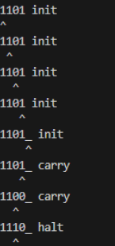

## Project structure: 
The project is divided into several files:
- **`turing.py`** - includes the implementation of a turing machine and display sequence of changes on the tape
- **`test_turing.py`** - contains pytest tests for various transition functions and input data on tape
- four text files with various transition functions 
### Installation and startup procedure
1. Clone the repository:
```bash
git clone https://github.com/kpta119/TuringMachine.git
```
2. Run the program:
```bash
python3 turing.py tape transition_function.txt
```
For exammple running program:
```bash
python3 turing.py 1101 increment.txt
```
#### and results of this run
<div style="text-align: center;">

